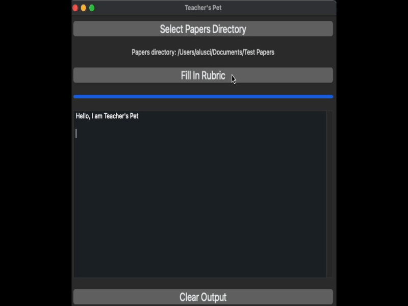

## 📝 Teacher's Pet – AI-Powered Essay Grading App

**Teacher's Pet** is a desktop application that leverages the power of OpenAI's **GPT-4o** model to **automatically grade and provide feedback on student essays**. Built with [BeeWare](https://beeware.org/), it offers a smooth native UI and can be installed as a **standalone app on your desktop**.



### 🚀 Features

- 📂 **Bulk essay grading**: Load multiple student essays from a local directory  
- 🤖 **GPT-4o-powered analysis**: Each essay is evaluated using OpenAI's cutting-edge model  
- ✍️ **Customizable grading criteria** *(Under Development)*: Adapt to different rubrics or assignment types  
- 💬 **Actionable feedback** *(Under Development)*: GPT-4o provides comments, scores, and suggestions for improvement  
- 🖥️ **Standalone desktop app**: Runs natively on your machine with BeeWare (no browser needed)

### 🔧 Tech Stack

- 🧠 **LLM**: OpenAI GPT-4o  
- 🖼️ **UI Framework**: BeeWare (Cross-platform Python GUI toolkit)  
- 🐍 **Language**: Python  
- 📦 **Local I/O**: Reads essays from `.txt` or `.docx` files in a selected directory

### 🔑 API Key Requirement

To use Teacher's Pet, you'll need to:

1. Obtain an OpenAI API key from [OpenAI's platform](https://platform.openai.com)
2. Add your API key to the `.env` file in the `teachers-pet/src/teachers_pet/resources/` directory:
   ```
   OPENAI_API_KEY=your_api_key_here
   ```

**Note**: API usage will incur costs based on your OpenAI account plan and the volume of essays processed.

### 📚 Use Cases

- Teachers looking to streamline grading  
- Tutors and educators who need quick insights on student writing  
- EdTech demos or AI-in-education research
